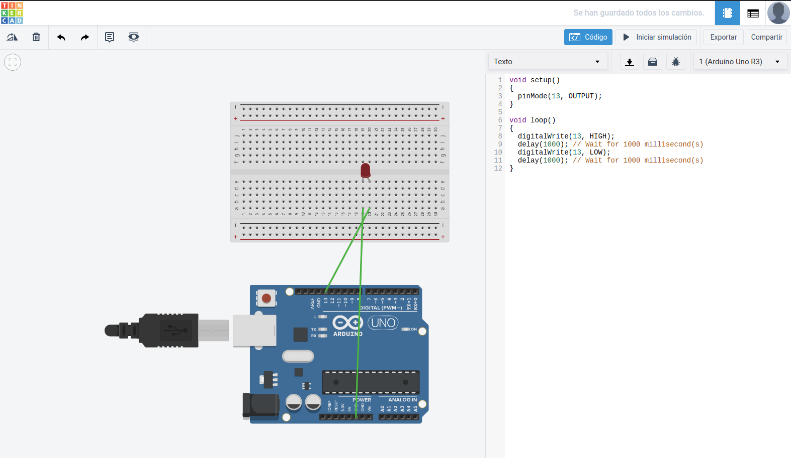

<h1>Ejercicio 1</h1>

<h2>Encendido y apagado de un led</h2>

| Material        | Cantidad           |
| ------------- |:-------------:|
| ESP8266       | 1      |
| Protoboard    | 1      |
| Led rojo      | 1      |
|Cable|X|

<h2>Procedimiento</h2>

Lo primero es realizar el esquema del montaje y probar el código en la aplicación web __Tinkercad__ (https://www.tinkercad.com/circuits).



Este es el código utilizado:

```c
int led = 13;

void setup() {
  // put your setup code here, to run once:
   pinMode(led, OUTPUT);
}

void loop() {
  // put your main code here, to run repeatedly:
  digitalWrite(led, HIGH);
  delay(1000);
  digitalWrite(led, LOW);
  delay(1000);  
}
```

Una vez testeado montamos el circuito en la __placa de prototipado__, conectamos los __pines__ correspondientes del __ESP__, pasamos el código al __IDE de arduino__ y lo subimos a la placa.

Una vez subido el código se ejecutará automáticamente.

[Enlace al vídeo del resultado en YouTube.](https://youtu.be/6-FfqL58mAA)

[Volver al índice](readme.md)
[Siguiente ejercicio](Ejercicio2.md)
