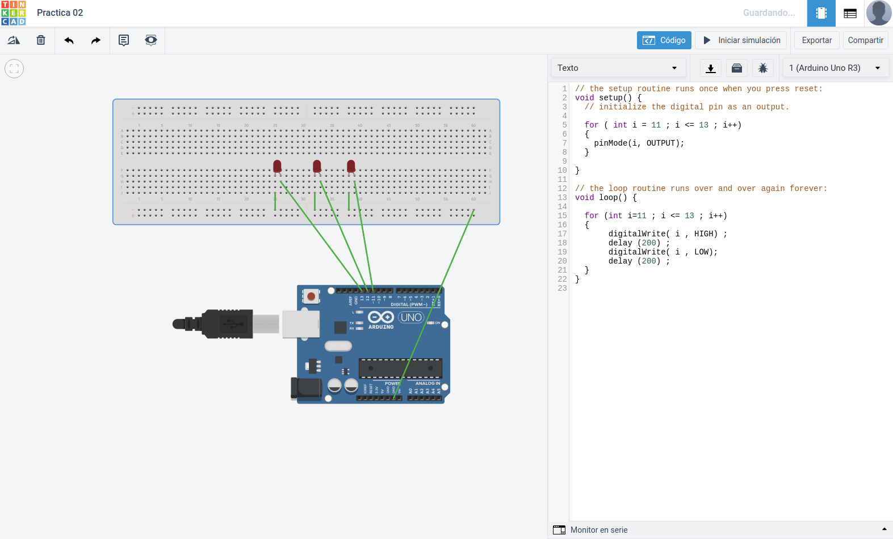

<h1>Ejercicio 2</h1>

<h2>Encendido y apagado de tres leds de forma consecutiva</h2>

| Material        | Cantidad           |
| ------------- |:-------------:|
| ESP8266       | 1      |
| Protoboard    | 1      |
| Led rojo      | 3      |
|Cable          | X      |      

<h2>Procedimiento</h2>

Lo primero es realizar el esquema del montaje y probar el código en la aplicación web __Tinkercad__.



Este es el código utilizado:

```c
void setup() {
  
    for ( int i = 12 ; i <= 14 ; i++)
  {
    pinMode(i, OUTPUT);
  }

}

void loop() {
      
  for (int i=12 ; i <= 14 ; i++)
  {
       digitalWrite( i , HIGH) ;
       delay (200) ;
       digitalWrite( i , LOW);
       delay (200) ;
  }

}
```

Una vez testeado montamos el circuito en la __placa de prototipado__, realizamos el montaje conectando los __pines__ correspondientes del __ESP__, pasamos el código al __IDE de arduino__ y lo subimos a la placa.

Una vez subido el código se ejecutará automáticamente.

[Enlace al vídeo del resultado en YouTube.](https://www.youtube.com/watch?v=6PnX7DMUtBI&feature=youtu.be)

A partir de este montaje provaremos versiones distintas del software.

La primera hará que los leds se alternen cada vez más rápido.

El código es el siguiente:

```c
int tiempo=200;

void setup() {
    for ( int i = 12 ; i <= 14 ; i++)
  {
    pinMode(i, OUTPUT);
  }

}

void loop() {
    
  for (int i=12 ; i <= 14 ; i++)
  {
       digitalWrite( i , HIGH) ;
       delay (tiempo) ;
       digitalWrite( i , LOW);
       delay (tiempo) ;
       tiempo-=10;
  }

}
```

#Video de los leds acelerando

La segunda alternativa hará que los leds se enciandan los tres a la vez.

Este es el código necesario:

```c
void setup() {
  for ( int i = 12 ; i <= 14 ; i++)
  {
    pinMode(i, OUTPUT);
  }

}

void loop() {
    
  for ( int i = 12 ; i <= 14 ; i++)
  {
    digitalWrite( i , HIGH) ;
  }
  
  delay (1000) ;
  
  for ( int i = 12 ; i <= 14 ; i++)
  {
    digitalWrite( i , LOW) ;
  }
  delay (1000) ;
}
```

[Enlace al vídeo del resultado en YouTube.](https://www.youtube.com/watch?v=a5tkJRlMbxE&feature=youtu.be)

Y por último haremos que las luces se enciendan de forma alterna, cuanto el led 1 y 3 se encienden el led 2 se apagará y viceversa.

Este es el código:

```c
void setup() {
    for ( int i = 12 ; i <= 14 ; i++)
  {
    pinMode(i, OUTPUT);
  }

}

void loop() {
      
  digitalWrite( 12 , HIGH) ;
  digitalWrite( 14 , HIGH) ;
  digitalWrite( 13 , LOW) ;
    
  delay (1000) ;
   
  digitalWrite( 12 , LOW) ;
  digitalWrite( 14 , LOW) ;
  digitalWrite( 13 , HIGH) ;
 
  delay (1000) ;
}
```

[Enlace al vídeo del resultado en YouTube.](https://www.youtube.com/watch?v=nlrVwDGPY7Y&feature=youtu.be)

[Volver al índice](Index.md)