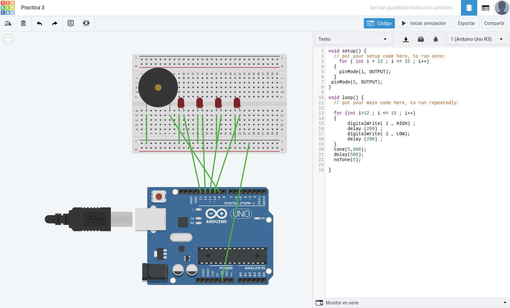

<h1>Ejercicio 3</h1>

<h2>Encendido y apagado de cuatro leds de forma consecutiva con sonido</h2>

| Material        | Cantidad           |
| ------------- |:-------------:|
| ESP8266       | 1      |
| Protoboard    | 1      |
| Led rojo      | 4      |
| Buzzer        | 1      |
| Cable         | X      |      

<h2>Procedimiento</h2>

Lo primero es realizar el esquema del montaje y probar el código en la aplicación web __Tinkercad__.



Este es el código utilizado:

```c
void setup() {
    for ( int i = 12 ; i <= 15 ; i++)
  {
    pinMode(i, OUTPUT);
  }
 pinMode(5, OUTPUT);
}

void loop() {
    
  for (int i=12 ; i <= 15 ; i++)
  {
    digitalWrite( i , HIGH) ;
    delay (200) ;
    digitalWrite( i , LOW);
    delay (200) ;
  }
  tone(5,800);
  delay(500);
  noTone(5);

}
```

Una vez testeado montamos el circuito en la __placa de prototipado__, realizamos el montaje conectando los __pines__ correspondientes del __ESP__, pasamos el código al __IDE de arduino__ y lo subimos a la placa.

Una vez subido el código se ejecutará automáticamente.

[Enlace al vídeo del resultado.](https://www.youtube.com/watch?v=ZGbAnuVAXnY&feature=youtu.be)

[Volver al índice](Index.md)