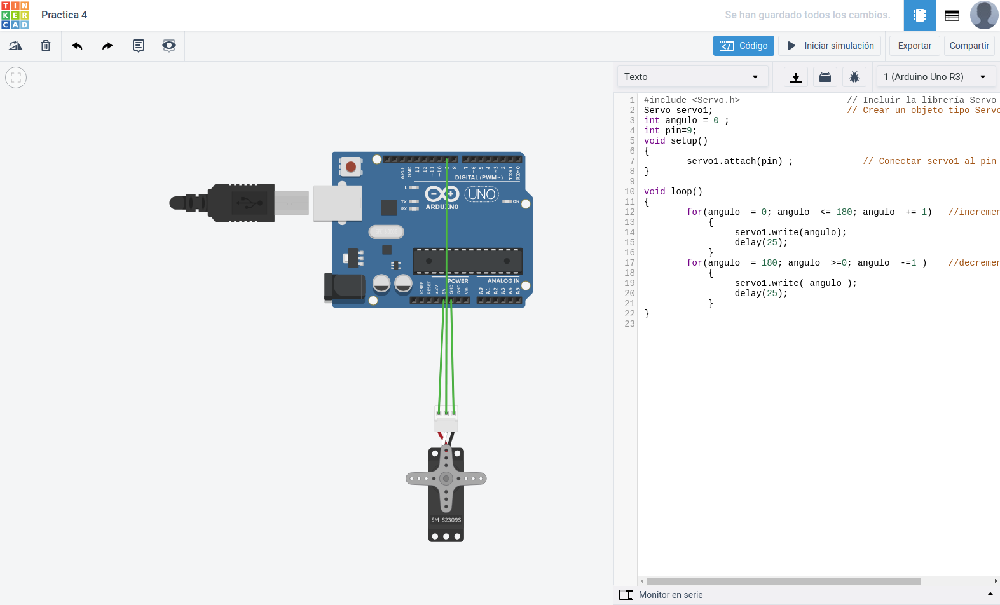

<h1>Ejercicio 4</h1>

<h2>Mover un servo motor</h2>

| Material        | Cantidad           |
| ------------- |:-------------:|
| ESP8266       | 1      |
| Protoboard    | 1      |
| Servo motor   | 1      |
| Cable         | X      |      

<h2>Procedimiento</h2>

Lo primero es realizar el esquema del montaje y probar el código en la aplicación web __Tinkercad__.



Este es el código utilizado:

```c
#include <Servo.h>                    // Incluir la librería Servo
Servo servo1;                         // Crear un objeto tipo Servo llamado servo1
int angulo = 0 ;
int pin=13;
void setup()
{
  Serial.begin(9600);
  servo1.attach(pin) ;
}

void loop()
{
  for(angulo  = 0; angulo  <= 180; angulo  += 1)   //incrementa angulo 1 grado
  {
    servo1.write(angulo);
    Serial.println(angulo);
 
    delay(25);
  }

  for(angulo  = 180; angulo  >=0; angulo  -=1 )    //decrementa angulo 1 grado
  {
    Serial.println(angulo);
    servo1.write( angulo );
    delay(25);
  }
}
```

Una vez testeado montamos el circuito en la __placa de prototipado__, realizamos el montaje conectando los __pines__ correspondientes del __ESP__, pasamos el código al __IDE de arduino__ y lo subimos a la placa.

Una vez subido el código se ejecutará automáticamente.

[Enlace al vídeo del resultado.](https://www.youtube.com/watch?v=-SIvr6ABD7o&feature=youtu.be)

[Volver al índice](Index.md)