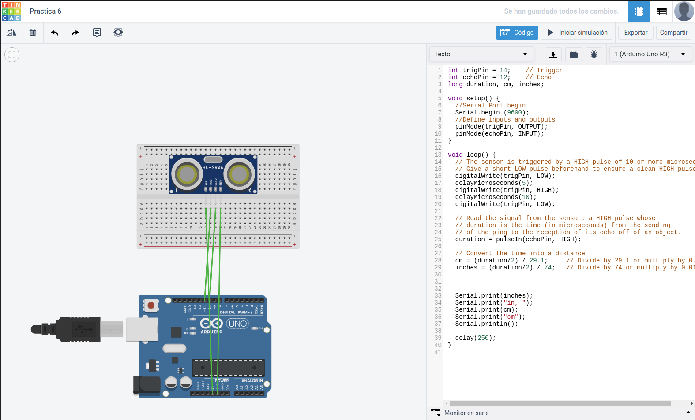

<h1>Ejercicio 6</h1>

<h2>Sensor de proximidad</h2>

| Material        | Cantidad           |
| ------------- |:-------------:|
| ESP8266       | 1      |
| Protoboard    | 1      |
| Sensor HC-SR04  | 1    |
| Cable         | X      |      

<h2>Procedimiento</h2>

Lo primero es realizar el esquema del montaje y probar el código en la aplicación web __Tinkercad__.



Este es el código utilizado:

```c
int trigPin = 14;    // Trigger
int echoPin = 12;    // Echo
long duration, cm, inches;
 
void setup() {
  //Serial Port begin
  Serial.begin (9600);
  //Define inputs and outputs
  pinMode(trigPin, OUTPUT);
  pinMode(echoPin, INPUT);
  pinMode(13, OUTPUT);
}
 
void loop() {
  digitalWrite(trigPin, LOW);
  delayMicroseconds(5);
  digitalWrite(trigPin, HIGH);
  delayMicroseconds(10);
  digitalWrite(trigPin, LOW);
 
  duration = pulseIn(echoPin, HIGH);
 
  // Convert the time into a distance
  cm = (duration/2) / 29.1;     // Divide by 29.1 or multiply by 0.0343
  inches = (duration/2) / 74;   // Divide by 74 or multiply by 0.0135

  if(cm<20){
    digitalWrite(13, HIGH);
    }else{
      digitalWrite(13, LOW);
    }
  
  Serial.print(inches);
  Serial.print("in, ");
  Serial.print(cm);
  Serial.print("cm");
  Serial.println();
  
  delay(250);
}
```

Una vez testeado montamos el circuito en la __placa de prototipado__, realizamos el montaje conectando los __pines__ correspondientes del __ESP__, pasamos el código al __IDE de arduino__ y lo subimos a la placa.

Una vez subido el código se ejecutará automáticamente.

__[Enlace al vídeo del resultado.](https://www.youtube.com/watch?v=37LEM_2rN6g&feature=youtu.be)__

[Volver al índice](readme.md)
